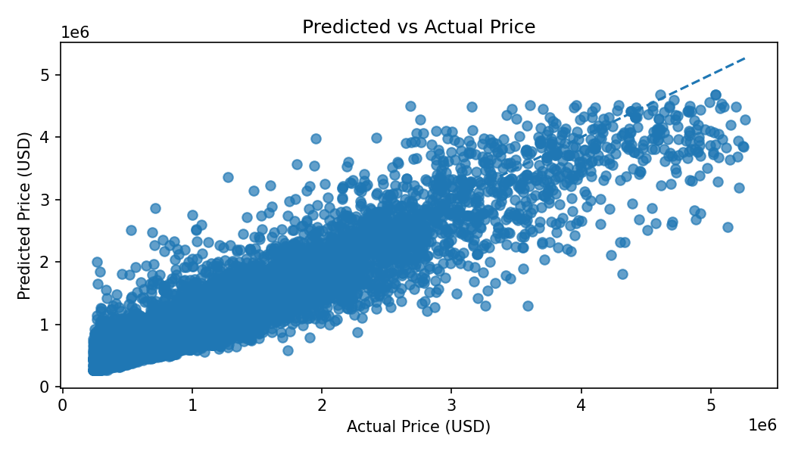
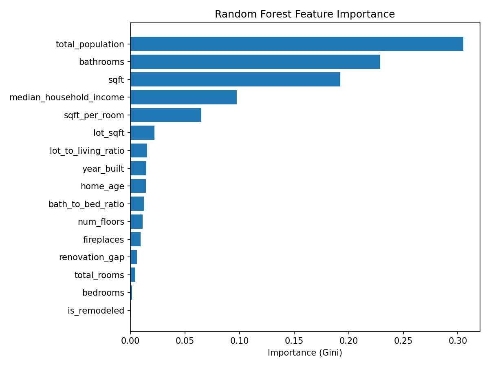
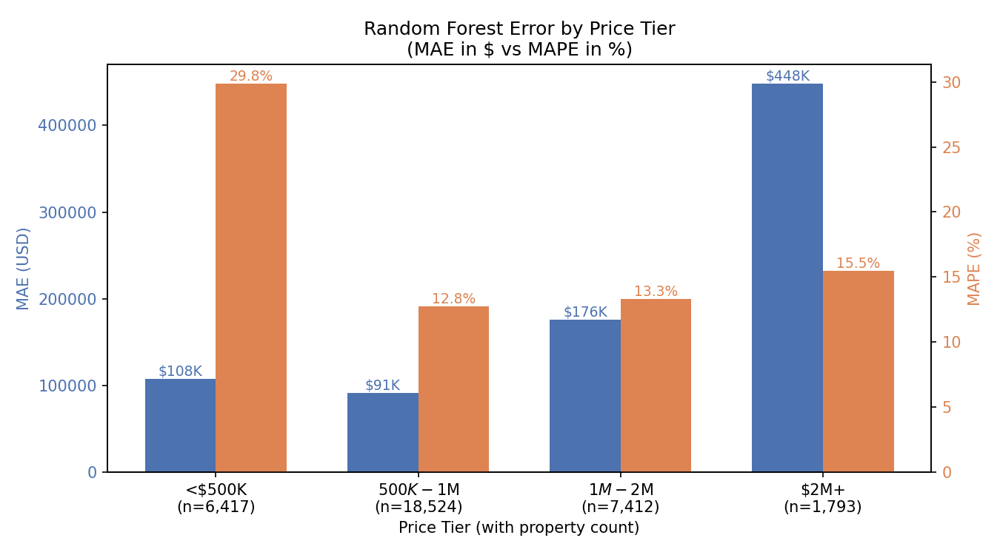
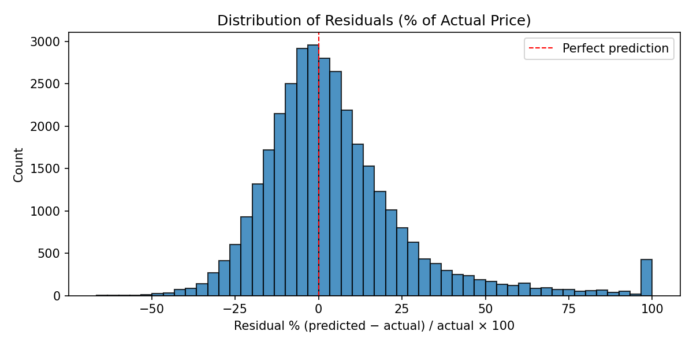
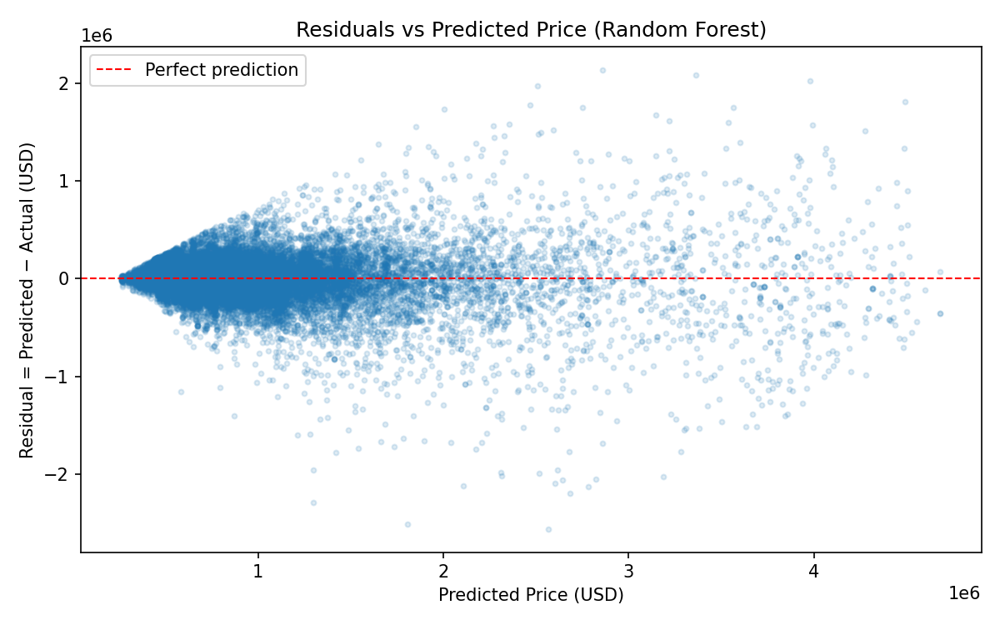
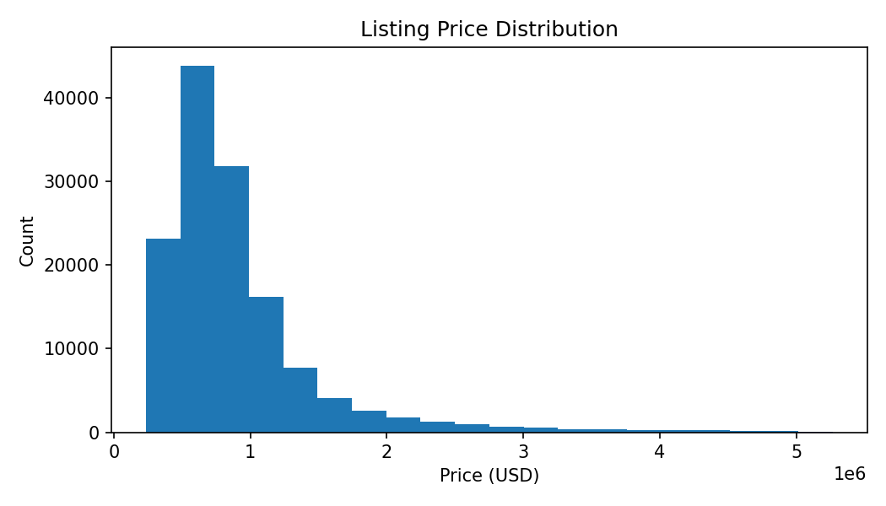
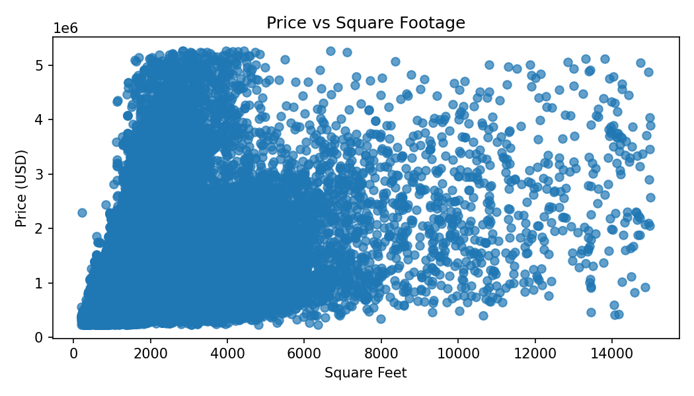

# Real Estate Value Analyzer

**CS 506 Final Project** — A residual-based mispricing analyzer for Greater Boston residential real estate.

📺 **Presentation video:** *[https://youtu.be/FeclCWGZ2S4]*
🎬 **Build & run demo:** *[https://youtu.be/hH0iqYcLV14]*

---

## Quick Start

The fastest way to reproduce our results from scratch:

```bash
git clone <this-repo>
cd RealEstate-Tracker
make all
```

`make all` runs the full pipeline end-to-end: creates a virtual environment, installs dependencies, downloads raw data, cleans + enriches it, trains the models, and saves results to `outputs/checkpoint2/`.

If you prefer to run steps individually:

```bash
make install     # Create venv + install dependencies
make data        # Download all raw datasets
make pipeline    # Clean + enrich -> boston_properties_enriched.csv
make model       # Train models + generate figures
make test        # Run pytest
```

Run `make help` for a full list of targets.

> **Note on data downloads:** the Boston Property Assessment CSV occasionally returns a 403 from data.boston.gov. If `make data` fails on this file, download the file "Property Assessment FY2026" manually from <https://data.boston.gov/dataset/property-assessment> and save it as `data/raw/boston_property_assessment_fy2026.csv`. Then re-run `make pipeline` and `make model`.

---

## What This Project Does

The residential real estate market suffers from information asymmetry: buyers and investors struggle to determine whether a listing is priced reasonably relative to comparable properties. Existing tools like Zillow's Zestimate are proprietary and don't expose how their estimates are derived.

We built an end-to-end data science pipeline that:

1. Estimates an **expected market price** for each Boston residential property based on observable features
2. Compares each property's actual assessed value to the model's expectation
3. Flags properties with the largest **positive or negative residuals** as candidates for relative mispricing

We do not claim to identify a property's "true" value. We identify properties whose assessed value is unusually high or low *given features the model can see*.

---

## Headline Results

Trained on 136,581 Greater Boston residential properties with 16 features.

### 5-fold cross-validation results

| Model | MAE | RMSE | R² | MAPE |
|---|---|---|---|---|
| Linear Regression (baseline) | $263,459 ± $929 | $420,700 ± $2,845 | 0.522 ± 0.004 | 31.12% ± 0.13% |
| **Random Forest (primary)** | **$133,915 ± $1,231** | **$220,750 ± $3,842** | **0.868 ± 0.004** | **16.41% ± 0.21%** |

Random Forest cuts MAE in half compared to the linear baseline and achieves R² = 0.868 — meaning it explains roughly 87% of the variance in Boston residential prices. The very small standard deviations across folds (R² varies by less than 0.5 percentage points) confirm the model's performance is stable and not an artifact of any particular train/test split.

### Median Absolute Percentage Error: 10.79%

Half of the model's predictions fall within ~11% of the actual assessed price — a more representative metric than the mean (MAPE) given the long-tailed price distribution.

### Error breakdown by price tier

The model's error varies substantially across the price range:

| Price Tier | Properties | MAE | MAPE |
|---|---|---|---|
| <$500K | 6,417 | $107,899 | **29.8%** |
| $500K–$1M | 18,524 | $91,150 | **12.8%** ← sweet spot |
| $1M–$2M | 7,412 | $176,003 | 13.3% |
| $2M+ | 1,793 | $447,718 | 15.5% |

The model performs best on mid-tier residential properties ($500K–$1M), where MAPE drops to 12.8%. It degrades on both ends: the cheapest tier has the highest **percentage** error (29.8% — a $108K miss on a $400K home is a large fraction of the price), while the luxury tier has the highest **dollar** error ($448K average miss). This is shown visually in `outputs/checkpoint2/figures/error_by_price_tier.png`.

For context: Zillow's Zestimate publishes a median absolute percentage error of roughly 2–7% on actively-listed homes. Our 10.79% is notably higher, mostly due to features we don't have (per-property latitude/longitude, sale history, walk score, school district). See **Limitations** below.

---

## Data

### Sources

| Dataset | Source | Used for |
|---|---|---|
| Property Assessment FY2026 | <https://data.boston.gov/dataset/property-assessment> | Primary dataset (price, sqft, beds, baths, year built, etc.) |
| Census ACS 5-Year (2019) | <https://api.census.gov/> | ZIP-level median income, total population, owner-occupancy |
| Zillow ZHVI by ZIP | <https://www.zillow.com/research/data/> | ZIP-level home value index + year-over-year market trend |

The assessment data covers all 184,552 taxable parcels in Boston. We filter to the 136,581 records with residential land-use codes (R1, R2, R3, R4, CD, A — single family, 2-family, 3-family, 4+ family, condo, apartment).

### Data collection method

Implemented in `scripts/download_datasets.py` and `scripts/fetch_api_data.py`:

- Direct HTTPS downloads from data.boston.gov and zillowstatic.com via `urllib`
- Census ACS pulled via the official Census API (no key required)
- Encoding fallback chain (utf-8 → latin-1 → cp1252) since city CSVs use inconsistent encodings
- Skip-if-exists logic so re-runs are fast

### Data cleaning

Implemented in `clean_assessment_data` in `src/real_estate_tracker/data_processing.py`. Ten steps:

1. **Schema validation** — fail fast if expected columns are missing
2. **Whitespace stripping** on column names (Boston exports sometimes have trailing spaces)
3. **Filter to residential** (LU codes R1–R4, CD, A) → 184,552 → 136,581
4. **Standardize column names** — handles both FY2024-style (`R_BDRMS`) and FY2026-style (`BED_RMS`) variants
5. **Numeric coercion** with comma-stripping (e.g., `"822,900"` → 822900)
6. **Combine bathrooms** = `full_bathrooms + 0.5 × half_bathrooms` (real estate convention)
7. **ZIP code padding** to 5 digits (catches `2127.0` floats)
8. **Outlier removal** — drop top/bottom 1% of prices (data errors at zero, idiosyncratic luxury at the top); filter sqft to [200, 15000]
9. **Missing value imputation** — median for `year_built`, mode for condition codes, 0 for `year_remodeled` (since 0 means *never remodeled*, a real value)
10. **Deduplication** on Parcel ID

### Enrichment

Implemented in `src/real_estate_tracker/feature_enrichment.py`. Two ZIP-level merges:

- **Census ACS** demographics (income, population, owner-occupancy %, median home value)
- **Zillow ZHVI** (latest value, year-over-year change %)

Census matched 100% of properties; Zillow matched ~97% (some Boston ZIPs aren't covered by Zillow's index).

---

## Feature Engineering

We use 16 features in three groups:

### Structural (8 features)
Direct measurements from the assessment data:
- `sqft`, `lot_sqft` — living area and lot area in square feet
- `bedrooms`, `bathrooms`, `total_rooms` — room counts
- `num_floors`, `fireplaces` — building features
- `year_built` — construction year

### Engineered ratios (6 features)
Derived in `add_assessment_features`:
- `sqft_per_room` = layout efficiency proxy (open vs. choppy floor plan)
- `home_age` = `2026 - year_built` (interpretable transformation)
- `bath_to_bed_ratio` = luxury indicator (modern builds approach 1.0)
- `lot_to_living_ratio` = urban-vs-suburban signal (condo: ~1, suburban single-family: 5–20)
- `is_remodeled` = binary flag (`year_remodeled > 0`)
- `renovation_gap` = years between original build and most recent remodel

### Neighborhood signal (2 features)
ZIP-level features merged from Census ACS:
- `median_household_income`
- `total_population`

---

## Modeling

### Setup

- **Train/test split**: 75/25, `random_state=42` for reproducibility
- **Cross-validation**: 5-fold KFold with shuffling, `random_state=42`
- **Linear Regression** (baseline) — sklearn defaults, no regularization
- **Random Forest** (primary) — 150 trees, `max_depth=10`, `n_jobs=-1`

We report metrics on both the single 75/25 split *and* 5-fold CV. The CV numbers are the more honest report of model performance; the single-split numbers are kept for comparison.

### Why Random Forest

Three reasons it beats linear regression by 35 R² points:

1. **Non-linear feature relationships** — price doesn't increase linearly with sqft (luxury threshold around 3,000 sqft creates a kink linear can't capture)
2. **Feature interactions** — RF can branch on `total_population` first, then handle `bathrooms` differently in dense urban ZIPs vs. suburban ones. Linear assumes effects are additive
3. **Robustness to extreme values** — `lot_to_living_ratio` has extreme values for tiny condos on huge parcels that overflowed linear regression's matmul. RF splits on thresholds, ignoring magnitude

### Random Forest feature importance

Top 5 features by Gini importance, accounting for ~88% of the model's decisions:

| Rank | Feature | Importance |
|---|---|---|
| 1 | `total_population` | 30% |
| 2 | `bathrooms` | 23% |
| 3 | `sqft` | 19% |
| 4 | `median_household_income` | 10% |
| 5 | `sqft_per_room` | 6% |

`total_population` ranking #1 is initially surprising. The reason: with only 34 ZIP codes in our data, `total_population` has only ~34 distinct values across 136K rows — it's effectively a categorical encoding of which Boston neighborhood a property is in. The Random Forest is using it as a proxy for the lat/long features we don't have. We expect its importance to drop substantially if per-property location features are added.

---

## Visualizations

All figures are in `outputs/checkpoint2/figures/` and are regenerated automatically by `make model`.

### Predicted vs Actual Price (Random Forest)



Each point is one test-set property, where the x-axis is the actual assessed value and the y-axis is the model’s predicted value. The dashed diagonal line represents perfect prediction, so points closer to this line mean the model predicted more accurately.

The cluster is tight along the diagonal from about $200K to $2M, showing that the Random Forest performs well for most normal residential properties. Above $3M, the points spread out more because luxury homes are rarer in the training data and often have unique features that are not captured by our dataset. Headline metrics: R² = 0.868, MAE = $134K, Median APE = 10.79%.

### Random Forest Feature Importance



This chart shows which features the Random Forest used most often to make predictions. Higher importance means the feature helped the model split the data and reduce prediction error more often.

The top 5 features account for about 88% of the model's decisions. `bathrooms`, `sqft`, and `median_household_income` are intuitive price drivers because larger homes, more bathrooms, and wealthier areas are usually associated with higher prices. `total_population` ranking #1 is structural: with only 34 ZIP codes in our dataset, this Census feature has only about 34 distinct values and effectively acts as a rough neighborhood indicator. Since we do not have per-property latitude and longitude, the model uses ZIP-level population as a proxy for location.

### Error by Price Tier (MAE in $ vs MAPE in %)



This chart compares model error across different price ranges using two metrics. MAE measures the average dollar error, while MAPE measures the average percentage error relative to the home’s value.

The model's error pattern flips depending on the metric. Cheap properties have the lowest dollar error, about $108K MAE, but the highest percentage error, about 29.8% MAPE, because a $108K miss is a large fraction of a $400K home. The $500K–$1M tier is the sweet spot, with the lowest percentage error and relatively low dollar error. Luxury properties have the largest dollar errors, about $448K MAE on $2M+ homes, because expensive homes vary more in features like finishes, views, and location quality. Overall, the model is most reliable in the mid-tier and less reliable at the extremes.

### Residual Distribution



This plot shows the distribution of residuals, or prediction errors, as a percentage of actual price. A residual near zero means the prediction was close to the actual assessed value.

The distribution is roughly bell-shaped and centered near 0, which suggests that the model is not heavily biased toward always overpredicting or always underpredicting. The slight right skew is important for this project because large positive residuals mean the model predicted a higher value than the actual assessed value. These are the properties that could be candidates for relative underpricing. The visible spike at +100% is a clipping artifact; raw residuals extend further into both tails.

### Residuals vs Predicted Price



This is a standard regression diagnostic plot. The x-axis shows the predicted price, and the y-axis shows the percentage residual.

The visible funnel shape shows that error variance increases as predicted price grows. This pattern is called heteroscedasticity, meaning the model’s errors are not equally spread across all price levels. In practical terms, the model is more consistent for lower and mid-priced homes, but less predictable for expensive homes. This is one reason Random Forest outperforms linear regression here, because linear regression assumes more constant error variance and a simpler relationship between features and price.

### Listing Price Distribution



This histogram shows the overall distribution of assessed property values in the dataset. Most homes are concentrated around the lower and middle price ranges, while a smaller number of expensive properties create a long right tail.

The median assessed value is about $747K, but the distribution extends to around $5M because of luxury properties. This skew is important because dollar-based metrics like MAE can be heavily influenced by expensive homes. That is why we report both dollar metrics, such as MAE, and percentage metrics, such as MAPE, to evaluate the model more fairly across the full price range.

### Price vs Square Footage



This scatter plot compares property price against square footage. Each point represents one property.

Although there is a general upward relationship, the plot shows extreme variance in price at the same square footage. For example, a 2,000 sqft property can be worth $400K or several million dollars depending on its neighborhood and other property characteristics. This shows why square footage alone is not enough to predict price. It also motivates our use of ZIP-level Census and Zillow features, because location-related information is necessary to explain why similar-sized homes can have very different values. The visible $5M ceiling comes from outlier clipping during preprocessing.per price tier — the "where does the model fail" plot |

---

## Limitations and Failure Cases

We are aware of the following limitations and would address them in future work:

### 1. No per-property location features

Our spatial signal is aggregated at the ZIP-code level (Census income, population, Zillow ZHVI). Per-property features like exact latitude/longitude, transit proximity, walkability, and school zones would substantially improve performance — but require integrating a parcel geocoding step we did not implement. This is the single largest factor explaining the gap between our 10.79% median APE and Zillow's published 2–7%.

### 2. Heteroscedastic error by price tier

The model's percentage error is highest on the cheapest properties (29.8% MAPE for <$500K) and dollar error is highest on luxury homes ($448K MAE for $2M+). This is visible in both `residuals_vs_predicted.png` and `error_by_price_tier.png`. Possible causes:

- Cheap properties include distressed/atypical homes that don't fit the standard model
- Luxury properties have idiosyncratic features (custom finishes, views, historic significance) that we don't capture
- Most training data is mid-tier, so the model is best in that regime

### 3. We model assessed value, not market value

The target variable is the city's official tax-assessed value — a proxy for market value but not the same thing. Massachusetts assessed values typically run 80–95% of true market value and lag actual transactions by months to a year. A version of this project trained on transaction prices (e.g., from Redfin or MLS) would be more directly useful for buy/sell decisions but requires data we don't have access to.

### 4. Single-snapshot data

Our enriched dataset is a fiscal-year 2026 snapshot. The model has no concept of price trajectories within a property, no time-series component, and no way to identify recently sold or recently renovated properties beyond the (often stale) `year_remodeled` field.

### 5. Census data is from 2019

The Census API endpoints for ACS years 2020–2022 returned HTTP 400 errors during data collection (likely due to ZCTA geography changes after 2020 requiring different request parameters). We fell back to the 2019 5-year ACS, which is the most recent that worked without an API key. Demographics shift slowly so this is acceptable, but a current-year version would be preferable.

### 6. Linear regression numerical issues

Linear regression triggers matmul overflow warnings during prediction due to extreme values in some engineered features (notably `lot_to_living_ratio` for tiny condos on large parcels). The numeric output is still produced, but the linear baseline would be cleaner with feature scaling. Random Forest is unaffected since it splits on thresholds rather than computing dot products.

### 7. Assumption of independent observations

Our train/test split treats each property as an independent draw. In reality, neighbors influence each other through comps and shared neighborhood factors. A more rigorous evaluation would split by ZIP or by date.

---

## Repository Structure

```
RealEstate-Tracker/
├── data/
│   ├── raw/                          # Downloaded datasets (gitignored)
│   ├── processed/                    # Cleaned + enriched CSVs (gitignored)
│   ├── sample_listings.csv           # 30-row sample for CI
│   └── README.md                     # Column dictionary
├── outputs/
│   └── checkpoint2/                  # Final model results
│       ├── metrics.json              # Single-split + CV metrics
│       ├── residuals.csv             # Per-property residuals
│       ├── run_summary.json          # Full run metadata
│       └── figures/                  # 7 PNG visualizations
├── scripts/
│   ├── download_datasets.py          # Download Assessment + Zillow CSVs
│   ├── fetch_api_data.py             # Fetch Census ACS via API
│   ├── run_pipeline.py               # Clean + enrich → enriched CSV
│   └── run_model.py                  # Train models + save figures + metrics
├── src/real_estate_tracker/
│   ├── data_processing.py            # Cleaning + feature engineering
│   ├── feature_enrichment.py         # Census + Zillow merges
│   ├── modeling.py                   # train_and_evaluate, cross-validation
│   └── visualization.py              # All plotting functions
├── tests/
│   ├── test_assessment_processing.py # Cleaning + features
│   ├── test_data_processing.py       # Sample data path
│   ├── test_feature_enrichment.py    # Haversine, Census, Zillow merges
│   └── test_pipeline_smoke.py        # End-to-end smoke test
├── .github/workflows/ci.yml          # GitHub Actions test runner
├── Makefile                          # Build automation
├── requirements.txt
└── README.md                         # This file
```

---

## Testing

We use `pytest` with 24 tests covering:

- Assessment data cleaning (residential filter, column renaming, bathroom combination, deduplication)
- Feature engineering (price_per_sqft, home_age, is_remodeled, etc.)
- Haversine distance (referenced for future spatial work)
- Census demographics merge
- Zillow ZHVI merge
- End-to-end smoke test on the sample dataset

Run them with:

```bash
make test
```

GitHub Actions runs the test suite automatically on every push and pull request — see `.github/workflows/ci.yml`.

---

## Environment

Tested on:

- Python 3.9 and 3.11
- macOS and Ubuntu (GitHub Actions)
- Virtual environment via `python -m venv .venv`

Dependencies (`requirements.txt`):
- `pandas >= 2.2.0`
- `numpy >= 1.26.0`
- `scikit-learn >= 1.4.0`
- `matplotlib >= 3.8.0`
- `pytest >= 8.0.0`
- `requests >= 2.31.0`

---

## Design Decisions

We explored a few additional modeling adjustments during development, which are documented
here for completeness but not included in the final model.

### Price per square foot
`price_per_sqft` was an early feature candidate — it directly normalizes price by living
area and is a standard metric in real estate analysis. We removed it because it is derived
from the target variable (price), meaning including it would let the model effectively
see the answer during training. With it included, R² rose to 0.998 — a clear signal of
target leakage rather than genuine predictive power.

### Property condition encoding
The Boston assessment data includes three condition ratings assigned by the city assessor:
`exterior_condition`, `overall_condition`, and `interior_condition`. These use a letter
scale (E=Excellent, G=Good, A=Average, F=Fair, P=Poor) and were excluded from earlier
checkpoints pending encoding. We ordinal-encode them (E=5, G=4, A=3, F=2, P=1) and add
them as three numeric features. A distressed property and a renovated one with identical
sqft, beds, and baths are indistinguishable to the model without these columns.

Adding condition encoding improved CV R² from 0.868 to 0.879, reduced MAE by ~$4,700,
and brought median APE down from 10.79% to 10.48%. However, condition ratings are
subjective assessor judgments rather than objective measurements — two assessors may
rate the same property differently, and ratings are updated infrequently. We chose not
to include them in the final submitted model to keep the feature set grounded in
verifiable, consistently-measured data.

### Log-transform of target price
Boston assessed prices are strongly right-skewed (median $747K, long luxury tail). Training
on raw dollar values causes the model to over-weight expensive homes during optimization.
We explored log-transforming the target via `TransformedTargetRegressor` (fit on log price,
predictions exponentiated back to dollars) — this reduced MAPE on the cheapest tier from
29.8% to 22.6% but decreased overall R² by ~0.5 points and increased error on the $2M+
tier. We chose not to apply it in the final submission to preserve overall model stability
across price tiers.

---

## Authors

Built for CS 506 (Spring 2026, Boston University) by:

- *[Eric Tang]*
- *[Mirza Faruq]*
- *[Adi Almukhamet]*
- *[Mohammed Attia]*
- *[Clemens Li]*

Replace the placeholder names above with actual teammates before final submission.

---

## License

This is a student project for CS 506. Code is for educational use. Data is from publicly available sources (City of Boston Open Data, US Census, Zillow Research) and remains subject to their respective terms of use.
